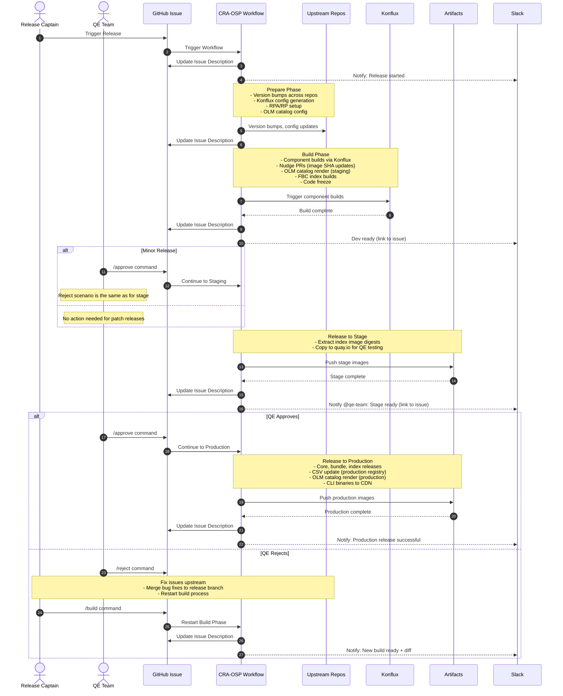

# 3. OSP Centralised Release Automation for OpenShift Pipelines

Date: 2026-09-17

## Status
Proposed

## Context

Releasing OpenShift Pipelines (OSP) is a complex, manual process. Release Captains (RCs) must coordinate across multiple teams while context-switching between GitHub, GitLab, Konflux, Quay, and Jira. Although individual build and test automations exist, they remain fragmented — requiring manual status checks and sequential triggering at every phase.

### Evolution and Current State

To solve this fragmentation, the team previously authored the [One Click Release Workflow proposal](https://docs.google.com/document/d/1X4uDPMKmpmd25319egeUD_MRwWIwpEg8on540uryoK8/edit?usp=sharing), which aimed to unify all steps into a single pipeline. However, this proposal was never implemented end-to-end. Instead, the team adopted the [`/one-click-release` Claude skill](https://github.com/openshift-pipelines/one-click-release/pull/3) as an interim "release terminal." While the skill proved the value of centralizing execution, relying on a local, LLM-driven process created problems:

- Using an LLM for deterministic workflows is inefficient and exhausts personal AI budgets.
- RCs must maintain local Claude setups with personal admin permissions across GitHub, Konflux, and Quay.
- If an RC becomes unavailable mid-release, there's no centralized tracking. Another team member can't pick up where they left off without wasting tokens re-analyzing progress or manually investigating across systems.
- External stakeholders rely entirely on manual status updates from the RC, causing sync delays across the global team.

## Decision
We propose Centralised Release Automation for OpenShift Pipelines (CRA-OSP): a deterministic release architecture that completes the vision of the original One Click Release proposal, replacing the interim Claude skill with a proper trigger and state engine.

- **GitHub Issues as the Control Plane**: RCs and stakeholders initiate, approve, and advance release milestones directly via GitHub Issue labels and ChatOps commands, removing local CLI dependencies and personal credential requirements.
- **GitHub as the Single Source of Truth**: GitHub Actions and Issues manage pipeline orchestration, state persistence, and approval workflows. Any authorized engineer can inspect progress, audit logs, or pick up an in-flight release.
- **Automated Slack Notifications**: Event-driven hooks automatically push status updates and blockers to dedicated Slack channels with team mentions, eliminating manual status loops across time zones.

### Design
**Why GitHub Issues?**

While the `/one-click-release` skill centralized release management, execution remained trapped on the RC's local terminal. Moving the control plane to GitHub Issues makes it accessible to everyone, providing identical control and full visibility to all stakeholders across time zones.

GitHub Issues serve as the primary interface to:

* **Trigger releases**: RCs apply issue labels or use ChatOps commands (e.g., `/build dev` to restart dev build) to initiate and progress minor or patch release sequences
* **Track live status**: Issue description is updated at each phase to reflect current progress, creating a real-time dashboard
* **Approval workflows**: QE team members approve/reject via ChatOps commands (`/approve`, `/reject`) with GitHub team-based RBAC enforcement and configurable approval counts
* **Audit trail**: Issue comments maintain a complete chronological log of all state transitions, builds, and decisions
* **State management**: Issue labels track workflow state, metadata, and phase progression

---

**GitHub as Control Plane and Source of Truth**

The [`one-click-release`](https://github.com/openshift-pipelines/one-click-release) repository acts as the single source of truth for all release state, artifacts, and orchestration.

* **State Tracking & Control**: GitHub Issues provide the complete interface for triggering, approving, and monitoring releases with native RBAC via repository permissions and GitHub Teams
* **Workflow Execution**: GitHub Actions listens for issue events (labels, commands) to execute the required phase, either directly on GitHub runners or by spawning a Tekton/OpenShift `PipelineRun` *(Open for discussion: runner vs. PipelineRun execution)*
* **Approval Gates**: GitHub team memberships and permissions enforce who can approve releases, with configurable approval thresholds
* **Service Account Security**: All downstream API operations across Konflux, Quay, and GitHub use secure service accounts, eliminating the need for individual RCs to maintain personal elevated privileges or local credentials

---

**Automated Slack Notifications**

Rather than requiring stakeholders to poll for updates, the automation actively broadcasts progress to Slack. Upon completing a release milestone or reaching an approval gate, GitHub Actions posts a notification to dedicated Slack channels, tagging relevant groups (e.g., `@qe-team`, `@docs-team`) with direct links to the GitHub Issue, status logs, and build artifacts.

Slack serves purely as a notification center; all actions (approvals, triggers, status checks) happen on the GitHub Issue.

---

**Artifact Collection & LLM-Assisted Debugging**

LLMs accelerate incident resolution during release failures when given rich context, especially for newer Release Captains. To get this benefit without wasting tokens during successful runs, we'll invoke LLM assistance only on failure.

When an error occurs in any pipeline step or build job, the automation will:

* Automatically extract relevant build logs, failure stack traces, and artifact summaries from GitHub Actions or Konflux `PipelineRuns`.
* Post the error directly to the release's Slack thread and tag `chai-bot`.
* Use `chai-bot`'s integration across Konflux data, Jira, GitHub, and historical Slack support threads to:
  * Analyze error patterns and identify historical precedent across Konflux releases.
  * Suggest immediate, actionable remediation steps directly in the thread.
  * Provide details for a Konflux support ticket if the issue requires platform intervention.

#### Architecture and Data Flow

**Key architectural components:**
- **GitHub Issues**: Control plane for triggers, approvals, and live status tracking
- **CRA-OSP Workflow**: Orchestration engine executing release phases
- **Slack**: Notification center for stakeholder updates with links back to GitHub Issue
- **External Systems**: Upstream repos, Konflux (builds), Artifacts (images, binaries)

**Notes:**
- On failure at any step, CRA posts to Slack and tags `@chai-bot` with full context for diagnostics
- Issue description serves as live dashboard, updated at each phase
- Issue comments provide complete audit trail of all state transitions
- All control actions (triggers, approvals, rebuilds) happen via GitHub Issue labels/commands

### Considered Alternatives

#### chai-bot Based Release Using an MCP Server
Build a custom Model Context Protocol (MCP) server that exposes release operations as executable tools to `chai-bot`, allowing RC to drive and query release pipelines conversationally directly inside Slack.

**Why it was considered**
* Native conversational UX - no need to configure rigid Slack Workflow forms or maintain strict command grammars.
* Uses `chai-bot`'s existing access to Konflux data, GitHub, Jira, and historical Slack support.
* Allows the AI agent to inspect pipeline states, answer open-ended status questions, and troubleshoot on the fly.

**Why it was rejected**
* Relying on `chai-bot` for core execution creates a single point of failure and makes critical release operations vulnerable to AI token budget constraints, rate limits, or organization-wide LLM policy changes.
* Requires building, hosting, securing, and maintaining a dedicated MCP server infrastructure.
* Driving a complex, multi-repository release state machine through an LLM risks non-deterministic behavior compared to a traditional, rule-based workflow engine.

#### Enhancing and Running Existing Skill on Ambient Platform
Deploy the existing `/one-click-release` Claude skill onto an internal ambient application platform to run as a hosted, centralized service rather than executing on individual RC workstations.

**Why it was considered**
* Reuses the existing, proven skill automation logic without requiring an immediate re-architecture of all release execution steps.
* Offloads execution from local RC terminals to a centralized platform, eliminating the need for local workstation setups.

**Why it was rejected**
* The target UAT ambient platform environment has been decommissioned.
* Even if ambient were hosted on a centralized platform, executing the skill would still consume personal AI token budgets, failing to solve organizational token constraints.
* The platform does not preserve conversation history or session context across runs. If an RC goes offline, another team member cannot inspect past interactions or track completed checkpoints to resume the release.

#### Good Old-fashioned Script
Consolidate all independent release steps into a unified, modular CLI script suite (Bash/Python) executed locally from the Release Captain's workstation.

**Why it was considered**

Straightforward to build, fully deterministic, eliminates LLM token consumption, and requires no complex cloud orchestration or webhook event loops. We're using this as the foundation for Phase 1.

**Why it was rejected as the final solution**
* RCs must still maintain local setups and personal elevated privileges across GitHub, GitLab, Konflux, Quay, and Jira on their workstations.
* Execution state remains trapped on the RC's local terminal. If an RC goes offline or shifts time zones mid-release, co-workers cannot track completed checkpoints or resume execution.
* Doesn't automate stakeholder visibility - external teams still rely on manual status updates from the RC instead of real-time Slack notifications.

## Consequences

### Benefits

**Efficiency**
- Runs without human intervention except at approval gates, eliminating context-switching overhead
- If QE discovers issues during release-testing, rebuilds can be triggered easily after upstream fix merges via ChatOps commands
- Service crashes don't lose progress, workflow resumes from last checkpoint automatically
- Multiple team members can monitor and interact with releases simultaneously via GitHub Issues

**Audit Trail**
- Every action, approval, and veto logged to Git commits, GitHub Issue comments, and structured logs
- Complete release history maintained in searchable, linkable GitHub Issues with permanent audit trail

**Team Integration**
- New builds completion automatically exports Jira tickets and commit data for QE
- When a new release is created, docs team receives Slack notifications with links to GitHub Issue containing all Jiras
- Automated Slack notifications eliminate manual status updates to stakeholders

**Reliability**
- Deterministic execution eliminates LLM token exhaustion and unpredictable behavior
- All reports committed to one-click-release repo maintain historical record
- Audit logs help track bottlenecks at various steps for further improvements

**Security & Access Control**
- RCs no longer need to store personal high-privilege tokens for GitHub, Quay, GitLab, and Konflux on their local workstations, reducing credential sprawl and endpoint attack surface
- Native GitHub RBAC via repository permissions and GitHub Teams enforces who can trigger releases and approve production deployments
- Configurable approval thresholds (e.g., require 2 QE approvals) prevent single-actor mistakes
- All actions tied to GitHub identities with full attribution and audit trail

**Developer Experience**
- Lowers the barrier to entry, allowing the Release Captain role to rotate across the entire team, preventing burnout and eliminating single-person dependencies
- New Release Captains can lead a release on Day 1 without spending hours configuring local CLI tools, API tokens, or troubleshooting local environment dependencies
- Familiar GitHub interface: RCs work where they already spend their day, no need to context-switch to Slack for control actions
- Issue description serves as live dashboard, issue comments provide chronological log

**Cost**
- Moving the happy-path execution away from LLMs yields measurable reduction in organization-wide AI token consumption, reserving token budget for complex failure diagnostics (`chai-bot`)

**Quality**
- Eliminates human error (such as skipping verification checks or running steps out of order) by enforcing a strict, code-defined release state machine

### Drawbacks

**Implementation Complexity**
- Creating the workflow to account for the deep branching would be complex
- Tight coupling with GitHub, Konflux, Jira, GitLab, Quay — any external API change requires service update
- ChatOps command/label parsing in GitHub Actions requires careful validation and error handling

**Operational Constraints**
- Certain steps require Red Hat VPN access which may not be available in all environments
- Troubleshooting failures across an asynchronous, event-driven loop is harder for maintainers than stepping through local CLI execution logs
- High-volume release activity risk hitting rate limits on GitHub's REST API or Slack's Webhook endpoints, potentially leading to dropped event payloads or stalled pipeline updates

**Migration Risks**
- Running both Claude skills and service creates duplicate effort during validation
- Release captains, QE, and docs teams need onboarding to new command grammar and approval flows
- If service fails mid-rollout, returning to Claude skills requires re-establishing local environments

**Credential Management**
- Service needs GitHub token, Jira token, Konflux token, GitLab token, Quay credentials — any compromise has broad impact
- Requires careful secret rotation and access audit procedures

### Follow-up Actions
If accepted, we propose a phased implementation for CRA-OSP to transition from local skills to a GitHub Issue-controlled GitHub Actions engine.

#### Implementation Plan
**Phase 1: CLI Script Extraction & Core Automation (Local Execution)**

Extract and standardize deterministic release steps into a suite of executable, modular scripts hosted in the [`one-click-release`](https://github.com/openshift-pipelines/one-click-release) repository.

* Extract CLI commands and API interactions from the `/one-click-release` Claude skill into standalone Bash/Python scripts
* Implement a local checkpoint file so scripts can track completed steps and resume from checkpoints on failure
* **Deliverable:** A fully scriptable CLI suite in `one-click-release` that can run end-to-end locally using standard environment variables

---

**Phase 2: GitHub Actions Engine, ChatOps Interface & Slack Notifications**

RCs begin using Phase 1 scripts locally while the p12n team builds the GitHub Actions orchestration engine with ChatOps control, approval workflows, and Slack notifications.

* RCs perform upcoming release cycles using the new CLI scripts locally to validate logic, identify edge cases, and ensure script stability
* **GitHub Actions Engine:**
  * Configure workflows to run the Phase 1 scripts inside GitHub runners
  * Configure the workflow to trigger on `issues` events (labels, comments with ChatOps commands) and manage state using GitHub primitives
  * Implement ChatOps command parser to handle `/release`, `/build`, `/approve`, `/reject` commands from issue comments
  * Update issue description as live dashboard at each phase completion
* **Approval Workflows:**
  * Integrate GitHub Teams for QE approval permissions
  * Implement approval threshold logic (e.g., require N approvals from `@qe-team`)
  * Add gating logic: pause execution when stage images are ready and wait for QE `/approve` commands
  * Validate approver permissions before proceeding to production
* **Security & RBAC Controls:**
  * Migrate individual RC tokens to centralized GitHub Organization Secrets (GitHub, GitLab, Konflux, Quay, Jira)
  * Leverage GitHub repository permissions and Teams for access control
  * Build action steps to validate `github.actor` against authorized teams before executing sensitive jobs
* **Slack Notifications:**
  * Add automatic Slack notifications at key milestones (build complete, stage ready, production deployed)
  * Tag relevant teams (`@qe-team`, `@docs-team`) with direct links to GitHub Issue
  * Include build artifacts, Jira tickets, and commit ranges in notifications
* **Failure Diagnostics with `chai-bot`:**
  * Add error-handling steps in GHA to extract build failure logs upon job failure
  * Post error summaries to Slack and automatically tag `@chai-bot` (`konflux-help` persona) for root-cause analysis
* **Deliverable:** End-to-end IssueOps automation where RCs trigger, monitor, and approve releases entirely via GitHub Issues, with automated Slack notifications keeping stakeholders informed
