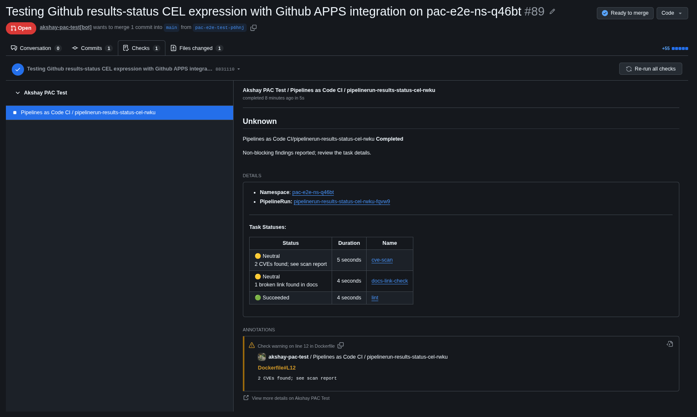
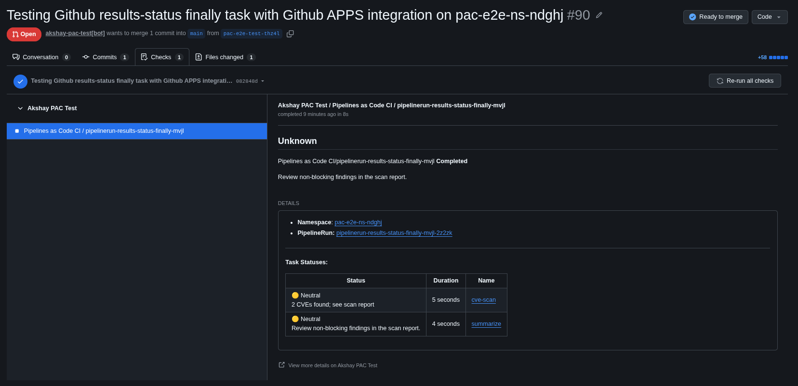

# ADR-0006: Pipelines as Code: Status Reporting Beyond Success/Failure

## Context

**Business Requirement:**

Pipelines as Code currently reports the overall PipelineRun status (success/failure) to VCS providers. Tasks that succeed technically but emit warnings, vulnerabilities, or other findings are indistinguishable from clean successes in the PR check. This creates a disconnect where:
- Pull requests show as passing when they contain non-blocking issues
- Developers miss actionable feedback until later stages (e.g., Enterprise Contract)
- VCS checks don't distinguish between "clean success" and "success with findings"

**Real Customer Impact ([KONFLUX-8688](https://redhat.atlassian.net/browse/KONFLUX-8688)):**

The Flatpaks team encountered this with `deprecated-base-image-check`:
- Task failed with a warning (deprecated base image detected)
- GitLab MR comment showed all tasks as "successful"
- Enterprise Contract later failed with "The Task 'deprecated-image-check' from the build Pipeline reports a test erred"
- Developer confusion: VCS check said "green," but the build was blocked downstream

This pattern repeats across security scans, linters, and quality checks — tasks that don't fail hard but surface actionable findings are invisible in VCS.

**Technical Problem:**

A successful Tekton run can still have findings: lint warnings, flaky tests, or vulnerabilities below a team's failure threshold. PaC currently reports the run's Tekton outcome, so those findings are indistinguishable from a clean run.

Tekton's `onError: continue` allows a pipeline to succeed despite an ignored task failure, but PaC's task table still renders that TaskRun as failed. Neither mechanism lets a task describe what its findings mean for Git reporting.

**Constraints:**
- No upstream Tekton API changes (TEP-0166 Task Notices and Warnings was closed)
- Must preserve existing behavior for PipelineRuns that don't opt in
- GitHub Checks API rate limits and annotation batch sizes (50 per request)
- Multi-provider support deferred (GitLab/Bitbucket tracked separately)

This proposal addresses [tektoncd/pipelines-as-code#1235](https://github.com/tektoncd/pipelines-as-code/issues/1235) and [SRVKP-7835](https://redhat.atlassian.net/browse/SRVKP-7835) using existing Tekton results. It does not depend on the closed Task Notices and Warnings proposal, [tektoncd/community#1262](https://github.com/tektoncd/community/pull/1262).

## Decision

Let pipeline authors report conclusions through named Tekton results. PaC reads those conclusions; it does not interpret scanner output or assign severity.

Phase 1 supports **GitHub Checks only**:

- A PipelineRun result supplies the overall check conclusion and an optional message.
- Eligible TaskRun results override their table rows and can produce inline annotations.
- An optional CEL expression computes the overall conclusion and an optional message from task results instead of a PipelineRun result.

This changes Git reporting, not Tekton conditions or scheduling. GitHub commit statuses and all other providers retain existing behavior, even when the new annotations are present.

### Architectural Overview

Pipeline authors opt in via annotation (`pipelinesascode.tekton.dev/results-status`), naming a Tekton result that contains either a bare conclusion string (`success`, `failure`, `neutral`, `skipped`) or a JSON object with conclusion, message, and optional location. PaC reads these results from completed PipelineRuns and eligible TaskRuns, validates the contract, and translates conclusions to GitHub Check states. CEL expressions enable custom rollup logic (e.g., "any failure blocks merge, neutral allows merge but shows warnings") without requiring a `finally` task. The reporting layer (`pkg/provider/github/status.go`) consumes validated overrides and delivers annotations independently from log parsing.

### Implementation Details

The detailed reporting contract, CEL evaluation, and table/annotation rendering are specified below.

#### Reporting Contract

##### Result selection

`pipelinesascode.tekton.dev/results-status` accepts one result name, such as `task-status`, or an ordered list, such as `[task-status, legacy-status]`. Trim surrounding whitespace; reject invalid Tekton result names, empty names/lists, duplicate names, and malformed list syntax.

Select the first present result independently from `PipelineRun.status.results` and each eligible `TaskRun.status.results`. An invalid selected value fails reporting; do not try a later name. If no candidate is present, retain Tekton-derived status.

Only terminal TaskRuns with no retry pending are eligible, and their `Succeeded` condition must be `True` or `False` with reason `FailureIgnored`. All other TaskRuns retain their existing rows and log-derived reporting. Their results are not consumed for overrides, CEL, or inline annotations, including invalid values.

##### Result format

A result is a string containing either a bare conclusion or a JSON object:

```json
{"conclusion": "neutral", "message": "2 CVEs found", "file": "Dockerfile", "line": 12}
```

Allowed conclusions are `success`, `failure`, `neutral`, and `skipped`. A message must be a string and is optional without a location. A location requires both `file` and `line`, plus a non-whitespace author-supplied message. Locations produce annotations only for TaskRun results.

An overall result can contain just the conclusion and message, for example `{"conclusion":"neutral","message":"Review the scan report before release."}`. Append its nonempty message to the GitHub Check's `output.summary`, preserving the standard status summary, task table, and policy diagnostics. Escape it as literal text and validate the composed summary against GitHub's size limit; an oversized summary is a reporting-policy error.

Paths must be nonempty and repository-relative, without parent-directory traversal; normalize a leading `./`. Lines must be positive integers representable by the API client. Messages are limited to 65,535 UTF-8 bytes. Reject invalid or oversized values rather than truncating them.

##### Overall conclusion and errors

Malformed selectors, invalid selected results, and CEL errors fail the GitHub Check with a visible diagnostic identifying the result/expression and affected TaskRun. An invalid task result also fails that row and the overall check, even without rollup or with another successful override.

An existing PipelineRun failure or cancellation always retains its conclusion; diagnostics are still shown. Otherwise, after validating configuration and selected results, use this precedence:

1. A valid PipelineRun result supplies both conclusion and message; CEL is not parsed or evaluated.
2. If no PipelineRun result is selected, evaluate the configured CEL expression.
3. If neither supplies an overall policy, use the Tekton outcome.

Missing optional results are not errors. TaskRun/result retrieval and annotation delivery failures use the status-reporting error/retry path, not successful fallback.

##### CEL and matrix tasks

`pipelinesascode.tekton.dev/results-status-expression` requires a valid `results-status` selector. It returns either an allowed conclusion string or a CEL map with `conclusion` and an optional `message`, using the same field validation and summary rendering as an overall result. Return the map directly, not a JSON-encoded string. Empty expressions, parse/type-check/evaluation errors, unsupported return types, invalid conclusions, and invalid messages are reporting-policy errors.

CEL receives `task_status` as `map(string, list(string))`, keyed by PipelineTask name:

```json
{"lint": ["success"], "tests": ["success", "failure"]}
```

Each eligible TaskRun contributes its selected conclusion once. Preserve equal values from distinct executions, sort by TaskRun name, and exclude retry history. Omit TaskRuns without selected results and keys with no eligible results.

PaC does not collapse matrix outcomes. Each execution keeps its own row and annotations; rows identify both the PipelineTask and TaskRun.

##### Table and annotations

Keep the Status/Duration/Name table layout. Show a finding message or policy diagnostic beneath the reported status in the existing Status cell. Escape HTML and Markdown so messages render as literal text, using controlled line breaks. Preserve log links, durations, emoji preferences, and unchanged output for rows without overrides.

Results with valid locations produce GitHub annotations: `failure` maps to `failure`, `neutral` to `warning`, and `success`/`skipped` to `notice`. Set both start and end lines to the supplied line.

Collect result annotations independently of log error detection: disabled detection, invalid regexes, and log-collection failures must not suppress them. Combine both annotation sources into batches of at most 50 per request. Do not resend acknowledged batches or silently drop failed batches.

#### Examples

Both examples emit illustrative findings rather than running scanners.

##### CEL expression

CEL chooses failure before neutral before success and supplies a corresponding Check summary message. No `finally` task or PipelineRun result is needed.

```yaml
apiVersion: tekton.dev/v1
kind: PipelineRun
metadata:
  name: "pipelinerun-results-status-cel-rwku"
  annotations:
    pipelinesascode.tekton.dev/target-namespace: "pac-e2e-ns-q46bt"
    pipelinesascode.tekton.dev/on-target-branch: "[main]"
    pipelinesascode.tekton.dev/on-event: "[pull_request]"
    pipelinesascode.tekton.dev/results-status: "task-status"
    pipelinesascode.tekton.dev/results-status-expression: >-
      task_status.exists(t, task_status[t].exists(c, c == "failure")) ?
        {"conclusion": "failure", "message": "At least one task reported blocking findings."} :
      task_status.exists(t, task_status[t].exists(c, c == "neutral")) ?
        {"conclusion": "neutral", "message": "Non-blocking findings reported; review the task details."} :
        {"conclusion": "success", "message": "No findings reported by opted-in tasks."}
spec:
  pipelineSpec:
    tasks:
      - name: lint
        taskSpec:
          results:
            - name: task-status
              type: string
          steps:
            - name: report
              image: registry.access.redhat.com/ubi10/ubi-micro
              script: |
                #!/bin/sh
                set -eu
                printf '%s' 'success' > "$(results.task-status.path)"
      - name: cve-scan
        taskSpec:
          results:
            - name: task-status
              type: string
          steps:
            - name: report
              image: registry.access.redhat.com/ubi10/ubi-micro
              script: |
                #!/bin/sh
                set -eu
                printf '%s' '{"conclusion":"neutral","message":"2 CVEs found; see scan report","file":"Dockerfile","line":12}' > "$(results.task-status.path)"
      - name: docs-link-check
        taskSpec:
          results:
            - name: task-status
              type: string
          steps:
            - name: report
              image: registry.access.redhat.com/ubi10/ubi-micro
              script: |
                #!/bin/sh
                set -eu
                printf '%s' '{"conclusion":"neutral","message":"1 broken link found in docs"}' > "$(results.task-status.path)"
```

Tekton succeeds. CEL receives `{"lint": ["success"], "cve-scan": ["neutral"], "docs-link-check": ["neutral"]}` and returns a `neutral` conclusion with the message "Non-blocking findings reported; review the task details." PaC displays that message in the Check summary. The `exists` checks cover every matrix execution and avoid looking up absent task keys.

Example PR: [theakshaypant/akshay-pac-test-repo#89](https://github.com/theakshaypant/akshay-pac-test-repo/pull/89)



##### Finally task

The `summarize` task reads the scan result and writes an overall conclusion and message. The Pipeline explicitly exposes that result through `pipelineSpec.results`; no CEL annotation is used.

```yaml
apiVersion: tekton.dev/v1
kind: PipelineRun
metadata:
  name: "pipelinerun-results-status-finally-mvjl"
  annotations:
    pipelinesascode.tekton.dev/target-namespace: "pac-e2e-ns-ndghj"
    pipelinesascode.tekton.dev/on-target-branch: "[main]"
    pipelinesascode.tekton.dev/on-event: "[pull_request]"
    pipelinesascode.tekton.dev/results-status: "task-status"
spec:
  pipelineSpec:
    results:
      - name: task-status
        description: Overall GitHub Check conclusion and message
        value: $(finally.summarize.results.task-status)
    tasks:
      - name: cve-scan
        taskSpec:
          results:
            - name: task-status
              type: string
          steps:
            - name: report
              image: registry.access.redhat.com/ubi10/ubi-micro
              script: |
                #!/bin/sh
                set -eu
                printf '%s' '{"conclusion":"neutral","message":"2 CVEs found; see scan report"}' > "$(results.task-status.path)"
    finally:
      - name: summarize
        params:
          - name: scan-status
            value: $(tasks.cve-scan.results.task-status)
        taskSpec:
          params:
            - name: scan-status
              type: string
          results:
            - name: task-status
              type: string
          steps:
            - name: summarize
              image: registry.access.redhat.com/ubi10/ubi-micro
              env:
                - name: SCAN_STATUS
                  value: $(params.scan-status)
              script: |
                #!/bin/sh
                set -eu
                case "${SCAN_STATUS}" in
                  *'"conclusion":"neutral"'*)
                    printf '%s' '{"conclusion":"neutral","message":"Review non-blocking findings in the scan report."}' > "$(results.task-status.path)"
                    ;;
                  *)
                    printf '%s' '{"conclusion":"failure","message":"Scan reported blocking findings."}' > "$(results.task-status.path)"
                    ;;
                esac
```

Tekton succeeds and exposes the JSON result in `PipelineRun.status.results`. PaC reports `neutral` with the summary message "Review non-blocking findings in the scan report."

A Task result alone does not populate PipelineRun results. If the scan does not emit its result, Tekton can skip the consuming `finally` task, leaving no overall override.

Example PR: [theakshaypant/akshay-pac-test-repo#90](https://github.com/theakshaypant/akshay-pac-test-repo/pull/90)



#### Implementation Guidance

Add the annotation keys in `pkg/apis/pipelinesascode/keys/keys.go`. Resolve TaskRun results through `pkg/kubeinteraction/status/task_status.go`; child references identify TaskRuns to fetch, not embedded results.

In `pkg/reconciler/status.go`, pass resolved overrides and the active GitHub Checks reporting gate to `pkg/sort/task_status.go`. A GitHub provider name alone is insufficient because commit statuses must remain unchanged. Extend the table row model with TaskRun identity, conclusion, message, and diagnostics without mutating Tekton conditions.

Keep condition-only formatting in `pkg/formatting/emoji.go` and `PipelineRunStatus` in `pkg/formatting/pipelinerun.go` as fallback. Add conclusion-aware row formatting, update the GitHub template, and deliver result annotations separately from log collection in `pkg/provider/github/status.go`. Carry the selected overall message through `pkg/provider/status.StatusOpts` and append it after the GitHub provider builds its standard summary. Reuse the CEL infrastructure in `pkg/cel`.

#### Other Reporting Paths

Existing adapters do not preserve `neutral` consistently:

| Reporting path | Current mapping | Limitation |
| ------ | ------ | ------ |
| GitHub Checks | Neutral | Supported in phase 1 |
| GitHub commit statuses | Success | No distinct findings state |
| GitLab | Canceled, titled "stopped" | Looks canceled rather than completed |
| Bitbucket Cloud | Stopped, titled "CI has stopped" | Looks stopped |
| Bitbucket Data Center | Failure, titled "CI has stopped" | Can block merge requirements |
| Gitea/Forgejo | Success | No distinct findings state |

Future phases must decide provider mappings, descriptions, merge behavior, and annotation support before enabling overrides. Bitbucket Code Insights is tracked in [tektoncd/pipelines-as-code#2747](https://github.com/tektoncd/pipelines-as-code/issues/2747); provider parity is not part of phase 1.

## Security & Compliance

**Security Considerations:**
- Result messages are **untrusted input** from pipeline authors and may contain sensitive data (secrets, PII, customer identifiers). Messages are escaped as literal text (HTML/Markdown) before rendering in GitHub Check summaries to prevent injection attacks.
- File paths in annotations are validated: must be repository-relative, no parent-directory traversal (`../`), nonempty. Invalid paths are rejected rather than normalized.
- CEL expressions are sandboxed and type-checked. Evaluation errors fail reporting with diagnostics; they do not execute arbitrary code.
- Authors remain responsible for the accuracy and content of reported findings. Invalid opted-in policies can block merges even when Tekton succeeds.

**RBAC Impact:**
- No new RBAC permissions required. PaC already has read access to PipelineRun and TaskRun resources and write access to Git provider APIs.
- No changes to Tekton RBAC, service accounts, or PaC's Kubernetes permissions.

**Compliance:**
- Result messages must not contain customer names or confidential identifiers (same guideline as existing PaC commit status messages).
- No data retention changes; results are read from ephemeral PipelineRun/TaskRun status and rendered into Git provider checks, which follow the provider's retention policy.

## Compatibility & Migration

**Backward Compatibility:**
- Runs without the `pipelinesascode.tekton.dev/results-status` annotation retain existing behavior (Tekton outcome reported to GitHub, no result-based overrides).
- Reporting paths outside GitHub Checks (GitHub commit statuses, GitLab, Bitbucket, Gitea, Forgejo) retain existing behavior even when annotations are present.
- No CRD changes, no RBAC changes, no migration of existing PipelineRun state required.

**Rollback Plan:**
- Rollback requires reverting the PaC version (downgrade to a version before this feature).
- No PipelineRun state migration needed; annotations are processed at reporting time, not stored in cluster state.
- Removing the annotations from a PipelineRun and re-running disables the policy (falls back to Tekton-derived status).

**Breaking Changes:**
- None. Feature is opt-in via annotation.

**Migration Path:**
- Pipeline authors add `pipelinesascode.tekton.dev/results-status` annotation and emit results from tasks.
- No data migration, no version lock-in, no cluster-wide configuration changes.

## Testability

**Testing Strategy:**

Use table-driven unit tests for the reporting contract, covering:
- Selector syntax, ordered first-present lookup, absent results, invalid selected values, and overall-result/CEL precedence
- TaskRun eligibility (terminal runs, retry handling, `FailureIgnored` reason), protected PipelineRun failures/cancellations, and invalid task results failing the overall check
- Matrix outcomes, duplicate conclusions from distinct executions, deterministic CEL input, missing keys, string/map CEL returns, and expression/result type errors
- Overall messages from PipelineRun results and CEL maps: optional/invalid messages, precedence without mixing sources, escaping, summary size boundaries, and preservation of task tables and failure/cancellation diagnostics
- Status-cell messages, literal markup, multiline text, emoji preferences, distinct matrix rows, and unchanged legacy rendering
- Location and message validation, integer/UTF-8 boundaries, annotation levels, independence from log detection, and combined batch sizes of 0, 1, 50, and 51

**Integration & E2E Tests:**

GitHub integration coverage must exercise:
- Conclusions (`success`, `failure`, `neutral`, `skipped`) rendered in GitHub Checks
- Task table rows with result-based overrides and messages
- Both examples' rollup logic (CEL expression and `finally` task) and summary messages
- Annotation delivery/retries (batches of 0, 1, 50, 51+ annotations)
- PipelineRun result mapping (the `finally` task example)

**Regression Tests:**

Verify that:
- Other reporting paths (GitHub commit statuses, GitLab, Bitbucket, Gitea, Forgejo) ignore both new annotations and retain existing behavior
- Existing log-derived annotations remain unchanged (combined with result annotations in batches)
- PipelineRuns without the annotation continue to report Tekton-derived status

**Critical Paths & Edge Cases:**
- Malformed selector (invalid list syntax, empty names, duplicate names) → reporting-policy error shown in Check
- Invalid selected result (malformed JSON, unsupported conclusion, oversized message) → reporting-policy error, overall Check fails
- CEL evaluation error → reporting-policy error with diagnostic identifying the expression
- TaskRun retrieval failure → status-reporting error/retry path (not silent fallback)
- Annotation delivery failure → retry, do not silently drop batches

## Operational Readiness

**Observability:**
- Log applied overrides at **debug level** using the provider logger: `"Applied result-based conclusion: neutral (from task: cve-scan)"`
- Log policy errors at **error level**: `"Result-based reporting failed: invalid conclusion 'warning' in task lint.task-status (expected success/failure/neutral/skipped)"`
- Show policy errors in the GitHub Check summary with a visible diagnostic identifying the result/expression and affected TaskRun, so users can correct the input and rerun
- Existing PaC metrics for status reporting (provider API call latency, error rates) cover this feature; no new metrics required

**Failure Modes:**
- **Invalid policy**: Pipeline author emits an invalid result → reporting-policy error shown in Check, overall Check fails. User corrects the result or removes the annotation and reruns.
- **CEL evaluation error**: Expression has a type error or references a missing task → reporting-policy error shown in Check. User fixes the expression or removes it.
- **GitHub API rate limit**: Annotation delivery hits rate limit → existing retry/backoff logic applies. PaC logs the error and retries.
- **Oversized summary**: Combined summary exceeds GitHub's size limit → reporting-policy error. User reduces message sizes.

**On-Call Impact:**
- **No new paging scenarios**. Failures are scoped to individual PipelineRuns (user-correctable policy errors) or existing GitHub API retry logic.
- Policy errors are visible in the Check, not silent failures. Users debug their own result schemas.
- Removing the annotations disables the policy (falls back to Tekton-derived status), providing an immediate escape hatch.

**Support Readiness:**
- Documentation must include common failure modes (invalid JSON, unsupported conclusions, oversized messages) with examples of correct result schemas.
- Examples in the ADR (`CEL expression` and `finally task`) serve as reference implementations.
- Migration guide for teams adopting enhanced status reporting from legacy behavior (add annotation, emit results, test with a PR).

## Scope

**In-Scope:**
- GitHub Checks API support for `neutral`, `failure`, `success`, and `skipped` conclusions based on task-level results
- Task-level findings surfaced as inline annotations in PRs (file, line, message)
- PipelineRun authors can define rollup logic via CEL expressions (e.g., "any failure blocks merge, neutral allows merge but shows warnings")
- Existing behavior preserved for PipelineRuns that don't opt into enhanced reporting via annotation
- Named result selection with ordered first-present lookup (`pipelinesascode.tekton.dev/results-status`)
- Overall conclusion from PipelineRun result or CEL expression
- Matrix task support (each execution keeps its own row and annotations)
- Validation and error reporting for malformed selectors, invalid results, and CEL errors

**Out-of-Scope (Future Phases or Not Planned):**
- Multi-provider support: GitLab, Bitbucket Data Center/Cloud, Gitea, Forgejo (tracked in [tektoncd/pipelines-as-code#2747](https://github.com/tektoncd/pipelines-as-code/issues/2747) for Bitbucket Code Insights)
- GitHub commit statuses (retain existing behavior; only GitHub Checks change in phase 1)
- Upstream Tekton API changes or new CRDs (use existing result schemas)
- PaC-owned severity rules or scanner output interpretation (authors define severity via result values)
- Log parsing enhancements (result annotations are independent of log-derived annotations)
- Standardized upstream task result conventions (TEP-0166 was closed; PaC defines its own contract)

## Acceptance Criteria

- [ ] Problem, scope, and non-goals are clear
- [ ] Alternatives were considered and compared
- [ ] Chosen option's trade-offs are documented
- [ ] Backward compatibility / migration path addressed
- [ ] Security/RBAC impact assessed
- [ ] Observability and rollback plan defined
- [ ] Required reviewers approved
- [ ] Open concerns resolved or tracked
- [ ] Decision is feasible to implement
- [ ] Documented in internal knowledge base

## Considered Options

| Option | Trade-off |
| ------ | --------- |
| Named conclusions with optional CEL (chosen) | Authors decide severity; PaC validates and reports. Requires author-maintained mapping rules and CEL support. |
| PaC-parsed notices or task-specific schemas | Standardizes inputs but makes PaC responsible for severity and task-domain logic. |
| Documentation or a standalone reporting task | Avoids PaC changes but requires separate provider calls and credentials rather than updating PaC's check. |
| No change | Successful runs continue to hide findings. |

## Decision Drivers

Key factors influencing this decision:

- **Faster feedback loops**: Developers see findings (security scans, lint warnings, test quality issues) in their PR before merging, rather than discovering them in downstream validation (Enterprise Contract, Pyxis, advisory checks).
- **Better visibility**: Security scans, lint warnings, and quality checks surface earlier in the development cycle, reducing rework.
- **Reduced confusion**: Eliminate contradiction between VCS checks (green) and downstream validation failures (red). A single source of truth for task outcomes.
- **Trust in CI system**: Make statuses transparent and intuitive. Users should not see a green check in their MR while a failure appears in the platform's UI.
- **Flexibility without upstream dependency**: Use existing Tekton results; do not block on upstream API changes or TEP standardization.
- **Author control over severity**: Pipeline authors decide what constitutes a blocking failure vs. non-blocking warning; PaC validates and reports without interpreting scanner output.

## Consequences

**Positive Outcomes:**
- **Faster feedback loops**: Developers see findings (security scans, lint warnings, test quality issues) directly in their PR before merging, rather than discovering them in downstream validation stages.
- **Better developer experience**: A single source of truth for task outcomes. No more contradiction between VCS checks showing green and Enterprise Contract/Pyxis/advisory checks failing red.
- **Increased trust in CI**: Statuses are transparent and intuitive. Users understand what "neutral with findings" means vs. "clean success."
- **Improved visibility**: Security vulnerabilities, deprecated dependencies, and code quality issues surface at PR review time when they're cheapest to fix.
- **No upstream dependency**: Uses existing Tekton result schemas; does not block on upstream TEP standardization.

**Risks and Drawbacks:**
- **Author complexity**: Pipeline authors must learn the result contract, CEL expression syntax, and rollup logic. Misconfigured policies can block merges even when Tekton succeeds.
- **Increased maintenance burden**: Authors must maintain CEL expressions or `finally` tasks to compute overall conclusions. No automatic severity assignment; authors own the mapping.
- **Phase 1 limited to GitHub Checks**: GitLab/Bitbucket/Gitea users cannot adopt this feature yet, despite the customer issue (KONFLUX-8688) originating from GitLab. Multi-provider parity is deferred.
- **Invalid policies can break workflows**: Malformed JSON, unsupported conclusions, or oversized messages fail reporting. Users must debug their own result schemas.
- **Potential for result size bloat**: Large numbers of annotations or oversized messages can hit GitHub API limits or etcd size constraints. No automatic truncation; validation rejects oversized content.
- **Security risk**: Result messages are untrusted input. Authors could accidentally leak secrets or PII in messages if not careful. Escaping prevents injection, but content filtering is the author's responsibility.

**Technical Debt and Follow-Up Work:**
- **Multi-provider support (GitLab, Bitbucket, Gitea, Forgejo)**: Tracked in [tektoncd/pipelines-as-code#2747](https://github.com/tektoncd/pipelines-as-code/issues/2747). Each provider has different conclusion/annotation capabilities; mapping decisions required.
- **Standardization with upstream Tekton**: If TEP-0166 or a similar proposal reopens, PaC's contract may need alignment or migration path.
- **Matrix task aggregation**: Current design preserves each matrix execution's findings separately. Some users may want aggregated rollup across executions.
- **Result size guardrails**: No enforcement of annotation count or message size limits before submission. Authors hit API errors at runtime rather than getting early validation.

## Dependencies

**Internal:**
- Tekton PipelineRun and TaskRun result schemas (no CRD changes required; use existing `results` field)
- Pipelines as Code VCS provider implementations (`pkg/provider/github/status.go`, `pkg/reconciler/status.go`)
- Existing CEL infrastructure in PaC (`pkg/cel`)
- GitHub Checks API capabilities for annotations and conclusion states

**External:**
- GitHub Checks API: rate limits, annotation batch sizes (50 per request), conclusion types, summary size limits
- No upstream Tekton version gates (feature uses existing result schemas available in all supported Tekton versions)

## References

**JIRAs:**
- [SRVKP-14883](https://redhat.atlassian.net/browse/SRVKP-14883): Epic - Pipelines as Code Enhanced Status Reporting
- [KONFLUX-8688](https://redhat.atlassian.net/browse/KONFLUX-8688): Customer issue - deprecated-base-image-check showed green in GitLab but failed Enterprise Contract
- [SRVKP-7835](https://redhat.atlassian.net/browse/SRVKP-7835): Standardized Task Output Results for CheckRun (TEST_OUTPUT convention)
- [SRVKP-11063](https://redhat.atlassian.net/browse/SRVKP-11063): Phase I Task Notices and Warnings (closed epic, explored upstream TEP approach)

**Upstream Tekton:**
- [tektoncd/pipelines-as-code#1235](https://github.com/tektoncd/pipelines-as-code/issues/1235): Originating feature request
- [TEP-0050: Ignore Task Failures](https://github.com/tektoncd/community/blob/main/teps/0050-ignore-task-failures.md): Tekton's `onError: continue`
- [tektoncd/community#1262](https://github.com/tektoncd/community/pull/1262): Closed Task Notices and Warnings proposal (TEP-0166)

**External APIs:**
- [GitHub Check Runs API](https://docs.github.com/en/rest/checks/runs): Annotation fields and request limits
- [Tekton PipelineRun Results](https://tekton.dev/docs/pipelines/pipelines/#emitting-results-from-a-pipeline): Result schema documentation

## Change Log

| Date | Author | Change Summary |
| ---- | ------ | -------------- |
| 2026-10-12 | @theakshaypant | Initial ADR |
